# wazuh-suricata-openvpn-lab

**NGFW-Enhanced Wazuh SOC Homelab: Integrating Suricata IDS and OpenVPN for Network Anomaly Detection**  
**January 2026 – Present**  
*Cybersecurity Enthusiast | SLIIT Student*

This project extends my core Wazuh SIEM homelab by adding next-generation firewall (NGFW)-style network visibility using open-source tools. I integrated **Suricata** as an Intrusion Detection System (IDS) and **OpenVPN** for simulated VPN monitoring, enabling detection of anomalies such as impossible travel (same user authenticating via VPN and locally in a short time window).

The setup demonstrates practical Tier 1 SOC analyst skills: multi-source log ingestion, custom rule development, alert correlation, and triage preparation—directly building on my ongoing Wazuh endpoint monitoring project.

## Project Highlights

- **Objective**: Simulate real-world SOC network monitoring in an isolated homelab, focusing on log collection from IDS and VPN sources alongside existing endpoint events.
- 
- **Key Achievements**:
  - Successfully installed and configured Suricata 7.0.3 for passive traffic capture, generating EVE JSON logs with application-layer details (HTTP, DNS, alerts).
  - Set up OpenVPN server with secure parameters (SHA256 digest, 2048-bit DH, TLS-Auth) and pushed internal lab routes to clients.
  - Ingested Suricata (JSON) and OpenVPN (syslog) logs into Wazuh for centralized analysis.
  - Developed custom Wazuh rules to correlate events (e.g., VPN connection + Windows local login within 5 minutes) for impossible travel detection.
  - Maintained full isolation using VirtualBox host-only networking (192.168.56.0/24) with promiscuous mode—no internet exposure.
 
    
- **Skills Demonstrated**:
  - SIEM Log Ingestion & Management (Wazuh)
  - Intrusion Detection Systems (Suricata)
  - VPN Configuration & Monitoring (OpenVPN)
  - Custom Detection Rule Writing
  - Network Traffic Analysis & Anomaly Detection
  - Linux System Administration
    
- **Tools & Technologies**: Wazuh SIEM, Suricata 7.0.3, OpenVPN, VirtualBox, Ubuntu Server.
  
- **Relevance to SOC Roles**: Mirrors Tier 1 responsibilities such as monitoring diverse log sources, identifying suspicious patterns, and preparing alerts for escalation. Aligns with MITRE ATT&CK techniques (e.g., T1078: Valid Accounts).

## Architecture Overview
- **Environment**: Isolated VirtualBox lab  
  – Ubuntu Server: Wazuh Manager + Suricata IDS + OpenVPN Server  
  – Windows 11: Monitored endpoint (Wazuh agent)  
  – Kali Linux: Safe simulation machine (VPN client, scans)

- **Network**: Host-only adapter (192.168.56.0/24) in promiscuous mode for full traffic visibility to Suricata.
  
- **Log Flow**:  
  Suricata → `/var/log/suricata/eve.json` (JSON) → Wazuh  
  OpenVPN → `/var/log/openvpn.log` (syslog) → Wazuh  
  Windows events → Wazuh agent

```text
[Kali Linux] ←→ (VPN Connect / Scans / Simulated Attacks) ←→ [Windows 11 Endpoint]
                                                                 ↑
                                                                 |
                                             [Ubuntu Server: Wazuh + Suricata + OpenVPN]

````

Step-by-Step Implementation (with Screenshots)

Install Suricata on Ubuntu
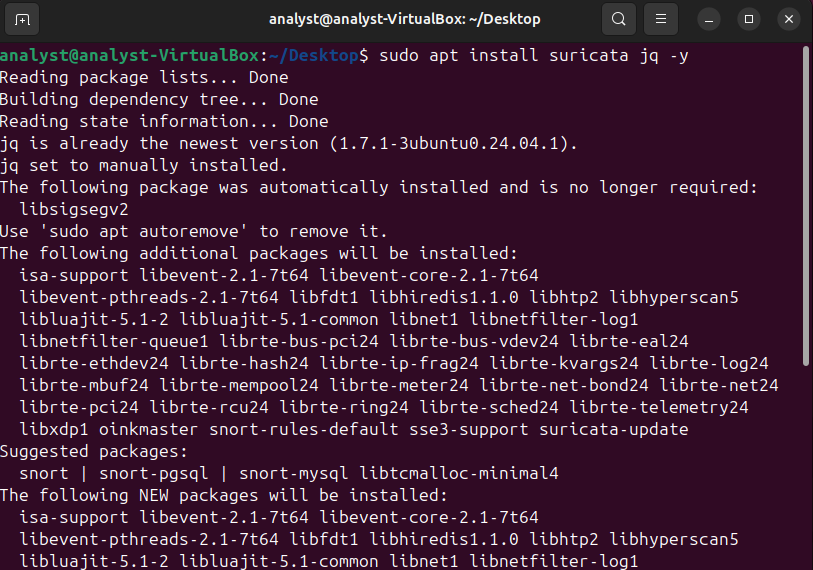

Download Suricata Rules Update
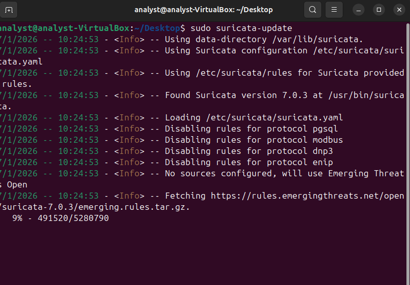

Edit Suricata Configuration
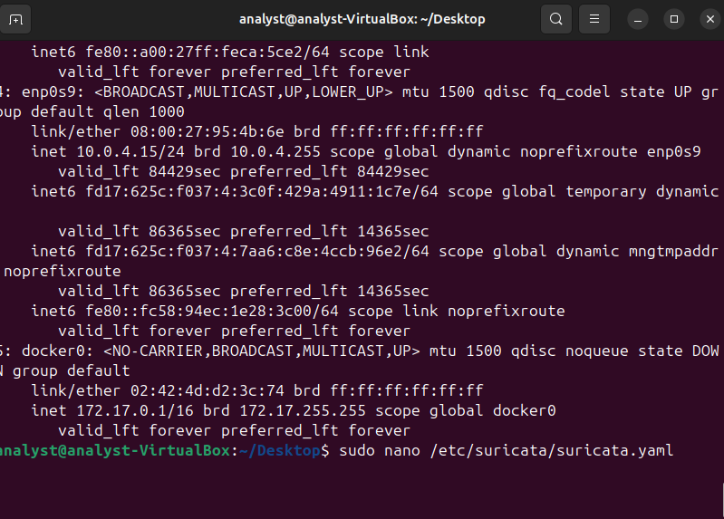

Set Packet Capture Interface
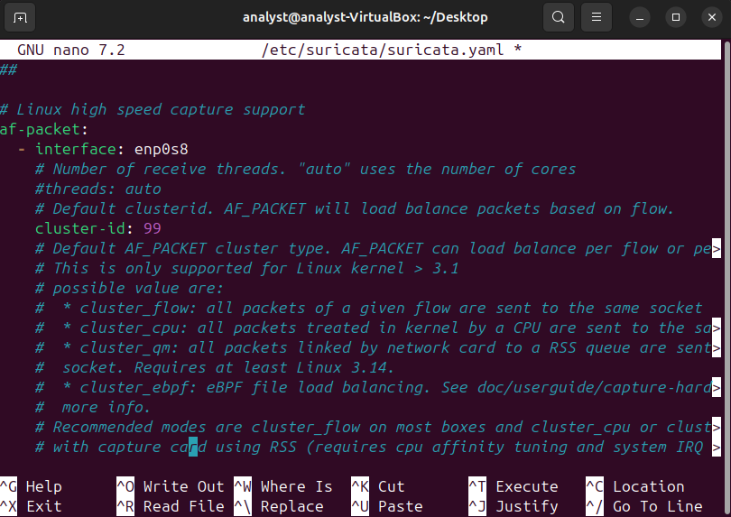

Update HOME_NET to Lab Subnet
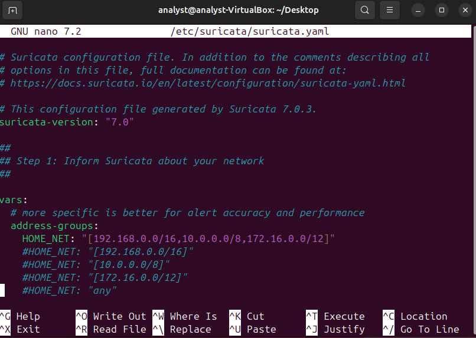

Enable EVE JSON Logging
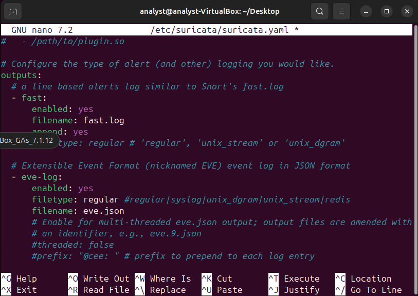

Start Suricata Service
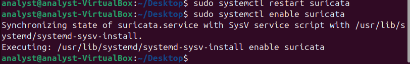

Verify Suricata Running
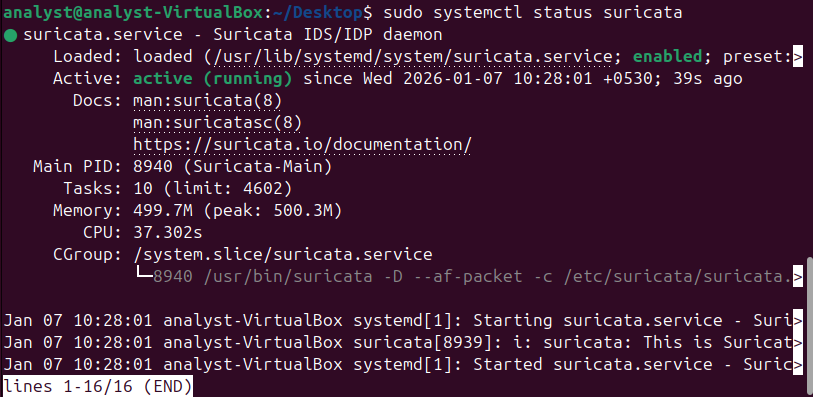

Install OpenVPN and Easy-RSA
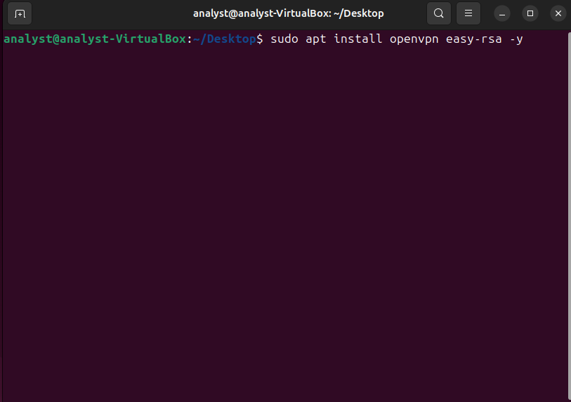

Create Easy-RSA Directory


Edit vars with Lab Details
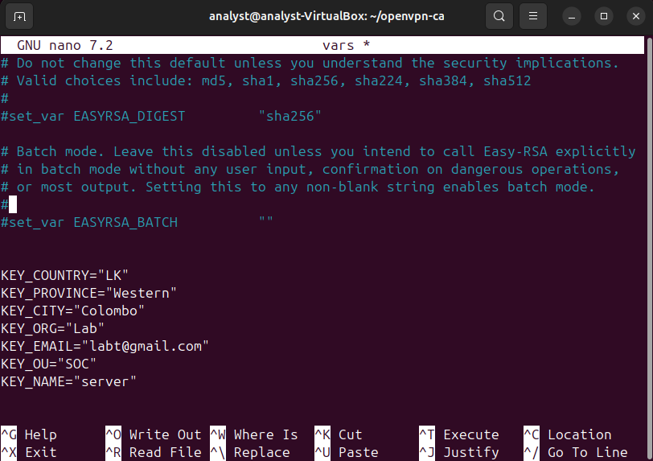

Generate Certificates and Keys
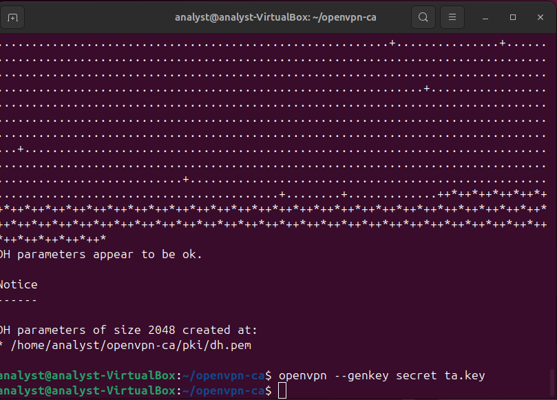

Configure OpenVPN Server
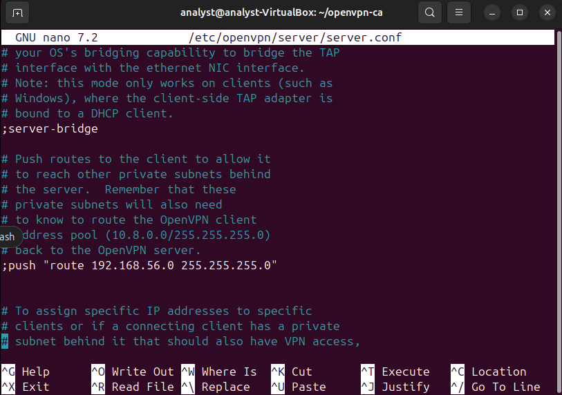

Check OpenVPN Service Status
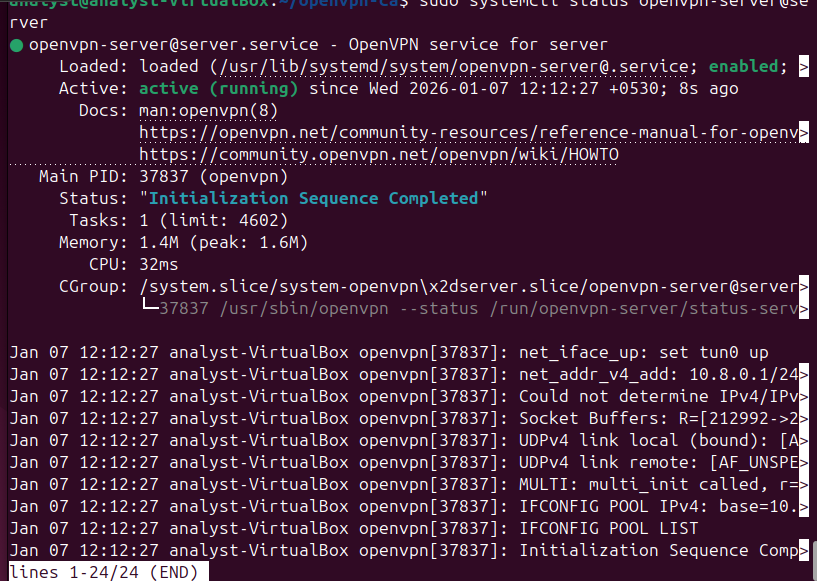

Add Suricata and OpenVPN Logs to Wazuh
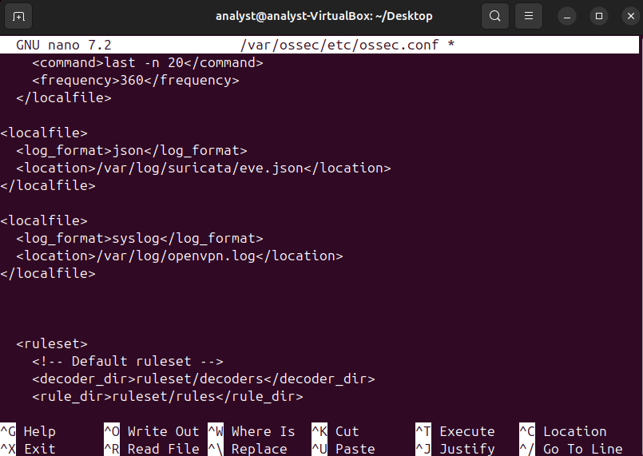

Restart Wazuh
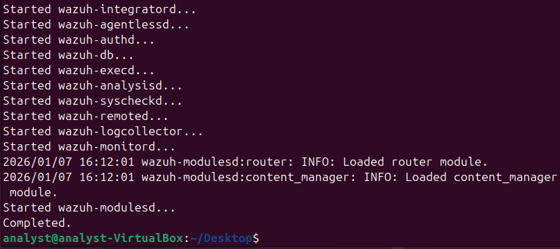

Custom VPN Correlation Rules
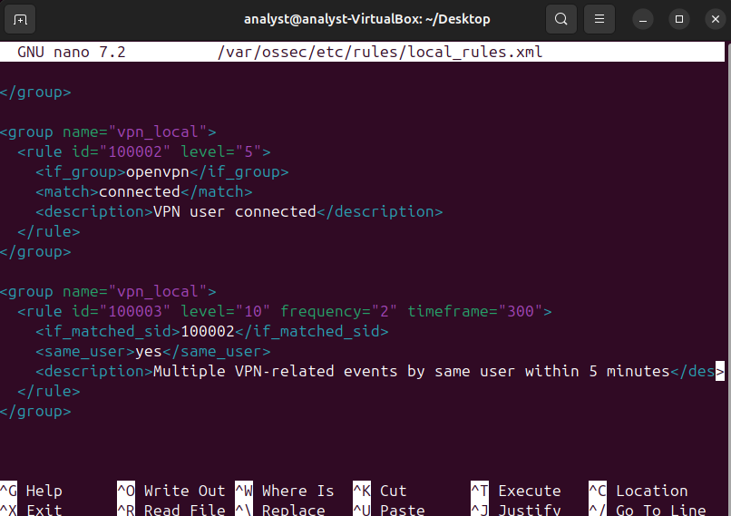

Example Rule: Local Login within 5 Minutes
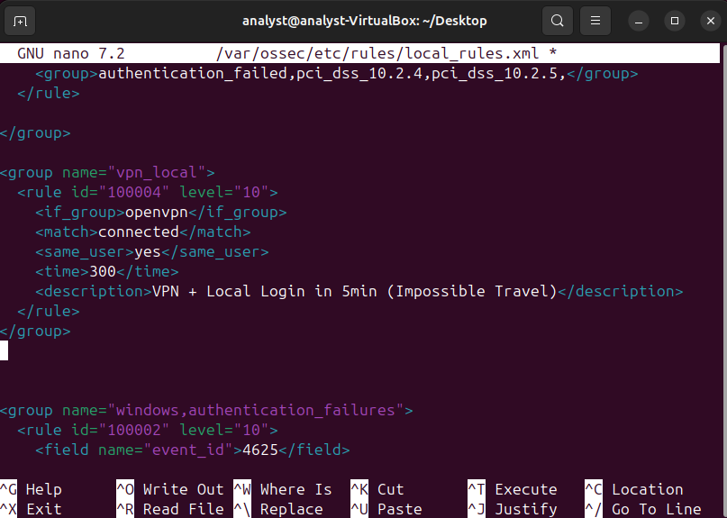

Testing & Validation

Simulated VPN connections from Kali and local Windows logins to validate rule triggering.
Observed Suricata alerts on network scans and OpenVPN authentication events in Wazuh dashboard.
Potential Improvements: Add GeoIP module for distance-based impossible travel; tune rules for lower false positives.

Learnings & Professional Value
This extension taught me how to bridge endpoint and network monitoring—critical for modern SOC environments where threats often involve lateral movement or credential abuse. It reinforces my ability to configure, integrate, and tune open-source security tools effectively in a resource-constrained setting.
For recruiters: This project showcases initiative, practical problem-solving, and progression from endpoint-focused detection to multi-layer visibility—ideal preparation for Tier 1 SOC analyst or internship roles.
Related Projects

Core Wazuh SOC Homelab – Endpoint Monitoring (May 2025 – Present) : https://github.com/nimesh895/wazuh-soc-homelab
Azure Security Monitoring Lab (Jan 2026 – Present) : https://github.com/nimesh895/azure-security-monitoring-lab


LinkedIn: linkedin.com/in/nimesh23
Email: desilvanimesha684@gmail.com
Feel free to reach out with questions or feedback!
